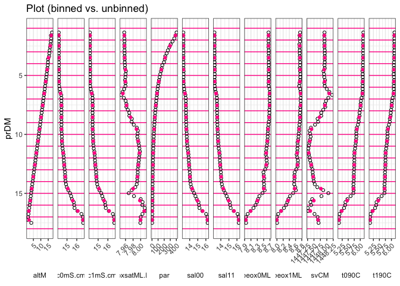
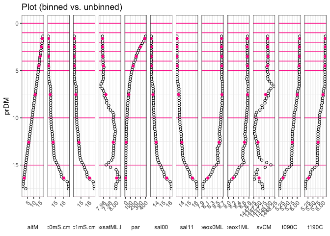

CTD binning
================
Marko Lipka
8/20/2018

Function is defined in **CTDbinning.R**.

Function *binCTD.mean()* applies the *mean()* function to all parameters of a given data frame binned by one of its parameters (usually depth or pressure).

Arguments:

-   **.data**: the data.frame to be summarized
-   **.binvar**: the variable name to bin over
-   **.breaks**: breaks as used by *cut()* (either a single value giving the number of equally distributed bins or a vector of cut points)
-   **.binwidth**: alternatively to **.breaks** the binwidth can be set (overwrites **.breaks**)

Example:
========

Raw example data
----------------

... from a CTD cast in the Arkona Basin (southern Baltic Sea). (... extracted from SBE CTD *.cnv* file with the helper function [**read.cnv.file()**](https://github.com/markolipka/readCNV))

``` r
load("example_ctd") # load dumped example data frame
ctd <- select(ctd, prDM : par) # reduce number of parameters for greater clarity

knitr::kable(head(ctd), digits = 1) # print table head
```

|  prDM|  c0mS.cm|  c1mS.cm|  t090C|  t190C|  sal00|  sal11|  sbeox0ML.L|  sbeox1ML.L|    svCM|  oxsatML.L|  altM|    par|
|-----:|--------:|--------:|------:|------:|------:|------:|-----------:|-----------:|-------:|----------:|-----:|------:|
|   1.4|     14.2|     14.2|    6.1|    6.1|   13.2|   13.2|         8.7|         8.7|  1447.9|          8|  17.6|  402.9|
|   1.6|     14.2|     14.2|    6.1|    6.1|   13.2|   13.2|         8.7|         8.7|  1447.9|          8|  16.8|  386.3|
|   1.9|     14.2|     14.2|    6.1|    6.1|   13.2|   13.2|         8.7|         8.7|  1447.9|          8|  17.0|  365.8|
|   2.1|     14.2|     14.2|    6.1|    6.1|   13.2|   13.2|         8.7|         8.7|  1447.9|          8|  16.8|  336.8|
|   2.4|     14.2|     14.2|    6.1|    6.1|   13.2|   13.2|         8.7|         8.7|  1447.9|          8|  16.5|  306.9|
|   2.6|     14.2|     14.2|    6.1|    6.1|   13.2|   13.2|         8.7|         8.7|  1447.9|          8|  16.3|  282.6|

``` r
knitr::kable(tail(ctd), digits = 1) # print table tail
```

|     |  prDM|  c0mS.cm|  c1mS.cm|  t090C|  t190C|  sal00|  sal11|  sbeox0ML.L|  sbeox1ML.L|    svCM|  oxsatML.L|  altM|  par|
|-----|-----:|--------:|--------:|------:|------:|------:|------:|-----------:|-----------:|-------:|----------:|-----:|----:|
| 60  |  16.2|     15.8|     15.8|    5.3|    5.3|   15.2|   15.2|         8.2|         8.2|  1447.3|          8|   2.2|  5.0|
| 61  |  16.5|     16.1|     16.1|    5.2|    5.2|   15.6|   15.6|         8.1|         8.1|  1447.3|          8|   1.9|  4.6|
| 62  |  16.7|     16.5|     16.5|    5.1|    5.1|   16.0|   16.1|         8.0|         8.0|  1447.5|          8|   1.7|  4.2|
| 63  |  17.0|     16.6|     16.6|    5.1|    5.1|   16.2|   16.2|         7.9|         8.0|  1447.6|          8|   1.4|  3.9|
| 64  |  17.3|     16.6|     16.6|    5.1|    5.1|   16.2|   16.2|         7.9|         8.0|  1447.7|          8|   1.1|  3.6|
| 65  |  17.5|     16.7|     16.7|    5.1|    5.1|   16.2|   16.2|         7.9|         8.0|  1447.7|          8|   3.6|  3.2|

Binned:
-------

### Example 1: binned by **.binwidth**

``` r
binned.binwidth <- binCTD.mean(.data = ctd,
                               .binvar = "prDM",
                               .binwidth = 1)

knitr::kable(binned.binwidth, digits = 1)
```

| bins     |  prDM|  c0mS.cm|  c1mS.cm|  t090C|  t190C|  sal00|  sal11|  sbeox0ML.L|  sbeox1ML.L|    svCM|  oxsatML.L|  altM|    par|
|:---------|-----:|--------:|--------:|------:|------:|------:|------:|-----------:|-----------:|-------:|----------:|-----:|------:|
| (1,2\]   |   1.6|     14.2|     14.2|    6.1|    6.1|   13.2|   13.2|         8.7|         8.7|  1447.9|          8|  17.1|  385.0|
| (2,3\]   |   2.5|     14.2|     14.2|    6.1|    6.1|   13.2|   13.2|         8.7|         8.7|  1447.9|          8|  16.4|  296.7|
| (3,4\]   |   3.5|     14.2|     14.2|    6.1|    6.1|   13.2|   13.2|         8.7|         8.7|  1447.9|          8|  15.2|  216.3|
| (4,5\]   |   4.5|     14.2|     14.2|    6.1|    6.1|   13.2|   13.2|         8.7|         8.7|  1447.9|          8|  14.3|  153.2|
| (5,6\]   |   5.5|     14.2|     14.2|    6.1|    6.1|   13.2|   13.2|         8.7|         8.7|  1447.9|          8|  13.3|  111.8|
| (6,7\]   |   6.5|     14.3|     14.3|    6.1|    6.1|   13.4|   13.4|         8.7|         8.8|  1448.1|          8|  12.3|   83.4|
| (7,8\]   |   7.5|     14.4|     14.4|    6.0|    6.0|   13.5|   13.5|         8.7|         8.8|  1447.9|          8|  11.2|   62.7|
| (8,9\]   |   8.5|     14.4|     14.4|    6.0|    6.0|   13.6|   13.6|         8.7|         8.7|  1447.7|          8|  10.2|   47.3|
| (9,10\]  |   9.6|     14.4|     14.4|    5.9|    5.9|   13.6|   13.6|         8.6|         8.7|  1447.4|          8|   9.1|   35.3|
| (10,11\] |  10.6|     14.5|     14.5|    5.8|    5.8|   13.7|   13.7|         8.6|         8.7|  1447.3|          8|   8.1|   25.8|
| (11,12\] |  11.6|     14.6|     14.6|    5.8|    5.8|   13.8|   13.8|         8.6|         8.7|  1447.3|          8|   7.0|   18.7|
| (12,13\] |  12.6|     14.7|     14.7|    5.8|    5.7|   13.9|   13.9|         8.6|         8.7|  1447.4|          8|   6.0|   13.7|
| (13,14\] |  13.6|     14.8|     14.8|    5.7|    5.7|   14.0|   14.0|         8.5|         8.6|  1447.5|          8|   4.9|   10.2|
| (14,15\] |  14.6|     15.1|     15.1|    5.7|    5.7|   14.3|   14.3|         8.5|         8.6|  1447.8|          8|   3.9|    7.8|
| (15,16\] |  15.6|     15.6|     15.6|    5.5|    5.5|   15.0|   15.0|         8.3|         8.4|  1447.5|          8|   2.9|    6.0|
| (16,17\] |  16.5|     16.1|     16.1|    5.2|    5.2|   15.6|   15.6|         8.1|         8.1|  1447.4|          8|   1.9|    4.6|
| (17,18\] |  17.3|     16.6|     16.6|    5.1|    5.1|   16.2|   16.2|         7.9|         8.0|  1447.7|          8|   2.1|    3.6|

``` r
binned.binwidth %>%
    gather(key = "variable", value = "value", -bins, -prDM) %>%
    ggplot() +
    aes(x = prDM, y = value) +
    geom_vline(xintercept = 1:18, color = "deeppink") +
    geom_point(data = gather(ctd, key = "variable", value = "value", -prDM),
               shape = 21) +
    geom_point(color = "deeppink") +
    facet_grid(~variable, scales = "free", switch = "x") +
    coord_flip() +
    scale_x_reverse() +
    theme_bw() +
    theme(axis.text.x = element_text(angle = 45, hjust = 1),
          strip.background = element_rect(fill = NA, colour = NA),
          strip.placement = "outside") +
    ylab(NULL) +
    ggtitle("Plot (binned vs. unbinned)")
```



### Example 2: binned by **.breaks**

``` r
breaks <- c(0, 1:5, 10, 15, +Inf)
binned.breaks <- binCTD.mean(.data = ctd,
                               .binvar = "prDM",
                               .breaks = breaks)

knitr::kable(binned.breaks, digits = 1) # print table
```

| bins      |  prDM|  c0mS.cm|  c1mS.cm|  t090C|  t190C|  sal00|  sal11|  sbeox0ML.L|  sbeox1ML.L|    svCM|  oxsatML.L|  altM|    par|
|:----------|-----:|--------:|--------:|------:|------:|------:|------:|-----------:|-----------:|-------:|----------:|-----:|------:|
| (1,2\]    |   1.6|     14.2|     14.2|    6.1|    6.1|   13.2|   13.2|         8.7|         8.7|  1447.9|          8|  17.1|  385.0|
| (2,3\]    |   2.5|     14.2|     14.2|    6.1|    6.1|   13.2|   13.2|         8.7|         8.7|  1447.9|          8|  16.4|  296.7|
| (3,4\]    |   3.5|     14.2|     14.2|    6.1|    6.1|   13.2|   13.2|         8.7|         8.7|  1447.9|          8|  15.2|  216.3|
| (4,5\]    |   4.5|     14.2|     14.2|    6.1|    6.1|   13.2|   13.2|         8.7|         8.7|  1447.9|          8|  14.3|  153.2|
| (5,10\]   |   7.5|     14.4|     14.4|    6.0|    6.0|   13.5|   13.5|         8.7|         8.7|  1447.8|          8|  11.2|   68.1|
| (10,15\]  |  12.6|     14.7|     14.7|    5.8|    5.8|   13.9|   14.0|         8.6|         8.6|  1447.5|          8|   6.0|   15.2|
| (15,Inf\] |  16.4|     16.1|     16.1|    5.3|    5.3|   15.5|   15.5|         8.1|         8.2|  1447.5|          8|   2.3|    4.8|

``` r
binned.breaks %>%
    gather(key = "variable", value = "value", -bins, -prDM) %>%
    ggplot() +
    aes(x = prDM, y = value) +
    geom_vline(xintercept = breaks, color = "deeppink") +
    geom_point(data = gather(ctd, key = "variable", value = "value", -prDM),
               shape = 21) +
    geom_point(color = "deeppink") +
    facet_grid(~variable, scales = "free", switch = "x") +
    coord_flip() +
    scale_x_reverse() +
    theme_bw() +
    theme(axis.text.x = element_text(angle = 45, hjust = 1),
          strip.background = element_rect(fill = NA, colour = NA),
          strip.placement = "outside") +
    ylab(NULL) +
    ggtitle("Plot (binned vs. unbinned)")
```



ToDo:
=====

-   might be useful to allow other functions than *mean()* for summarizing?!
