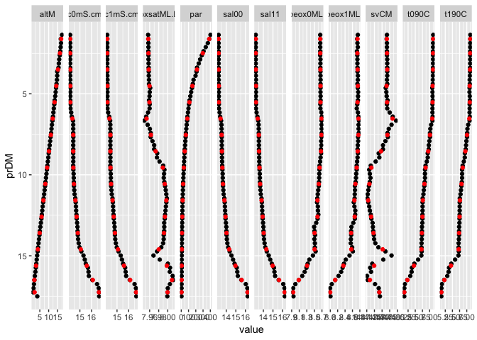

CTD binning
================
Marko Lipka
8/20/2018

Example data
============

``` r
load("example_ctd") 
ctd <- select(ctd, prDM : par)

binned <- binCTD.mean(.data = ctd,
                      .binvar = "prDM",
                      .binwidth = 1)

binned %>%
    gather(key = "variable", value = "value", -bins, -prDM) %>%
    ggplot() +
    aes(x = prDM, y = value) +
    geom_point(data = gather(ctd, key = "variable", value = "value", -prDM)) +
    geom_point(color = "red") +
    facet_grid(~variable, scales = "free") +
    coord_flip() +
    scale_x_reverse()
```


