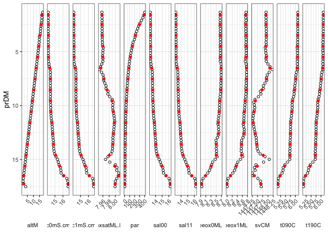

CTD binning
================
Marko Lipka
8/20/2018

Functions are defined in **CTDbinning.R**.

Function *binCTD.mean()* applies the *mean()* function to all parameters of a given data frame binned by one of its parameter (usually depth or pressure).

Arguments:

-   **.data**: the data.frame to be summarized
-   **.binvar**: the variable name to bin over
-   **.breaks**: breaks as used by *cut()* (either a single value giving the number of equally distributed bins or a vector of cut points)
-   **.binwidth**: alternatively to **.breaks** the binwidth can be set (overwrites **.breaks**)

Example:
========

Raw example data
----------------

from a CTD cast in the Arkona Basin (southern Baltic Sea).

``` r
load("example_ctd") 
ctd <- select(ctd, prDM : par)

knitr::kable(ctd, digits = 1)
```

|  prDM|  c0mS.cm|  c1mS.cm|  t090C|  t190C|  sal00|  sal11|  sbeox0ML.L|  sbeox1ML.L|    svCM|  oxsatML.L|  altM|    par|
|-----:|--------:|--------:|------:|------:|------:|------:|-----------:|-----------:|-------:|----------:|-----:|------:|
|   1.4|     14.2|     14.2|    6.1|    6.1|   13.2|   13.2|         8.7|         8.7|  1447.9|        8.0|  17.6|  402.9|
|   1.6|     14.2|     14.2|    6.1|    6.1|   13.2|   13.2|         8.7|         8.7|  1447.9|        8.0|  16.8|  386.3|
|   1.9|     14.2|     14.2|    6.1|    6.1|   13.2|   13.2|         8.7|         8.7|  1447.9|        8.0|  17.0|  365.8|
|   2.1|     14.2|     14.2|    6.1|    6.1|   13.2|   13.2|         8.7|         8.7|  1447.9|        8.0|  16.8|  336.8|
|   2.4|     14.2|     14.2|    6.1|    6.1|   13.2|   13.2|         8.7|         8.7|  1447.9|        8.0|  16.5|  306.9|
|   2.6|     14.2|     14.2|    6.1|    6.1|   13.2|   13.2|         8.7|         8.7|  1447.9|        8.0|  16.3|  282.6|
|   2.9|     14.2|     14.2|    6.1|    6.1|   13.2|   13.2|         8.7|         8.7|  1447.9|        8.0|  15.9|  260.4|
|   3.1|     14.2|     14.2|    6.1|    6.1|   13.2|   13.2|         8.7|         8.7|  1447.9|        8.0|  15.8|  240.9|
|   3.4|     14.2|     14.2|    6.1|    6.1|   13.2|   13.2|         8.7|         8.7|  1447.9|        8.0|  15.6|  217.5|
|   3.6|     14.2|     14.2|    6.1|    6.1|   13.2|   13.2|         8.7|         8.7|  1447.9|        8.0|  14.8|  209.8|
|   3.9|     14.2|     14.2|    6.1|    6.1|   13.2|   13.2|         8.7|         8.7|  1447.9|        8.0|  14.8|  196.8|
|   4.1|     14.2|     14.2|    6.1|    6.1|   13.2|   13.2|         8.7|         8.7|  1447.9|        8.0|  14.7|  169.3|
|   4.4|     14.2|     14.2|    6.1|    6.1|   13.2|   13.2|         8.7|         8.7|  1447.9|        8.0|  14.4|  159.6|
|   4.6|     14.2|     14.2|    6.1|    6.1|   13.2|   13.2|         8.7|         8.7|  1447.9|        8.0|  14.2|  147.8|
|   4.9|     14.2|     14.2|    6.1|    6.1|   13.2|   13.2|         8.7|         8.8|  1447.9|        8.0|  13.9|  136.2|
|   5.1|     14.2|     14.2|    6.1|    6.1|   13.2|   13.2|         8.7|         8.8|  1447.9|        8.0|  13.7|  125.3|
|   5.4|     14.2|     14.2|    6.1|    6.1|   13.2|   13.2|         8.7|         8.7|  1447.9|        8.0|  13.4|  115.3|
|   5.6|     14.2|     14.2|    6.1|    6.1|   13.2|   13.2|         8.7|         8.7|  1447.9|        8.0|  13.2|  107.0|
|   5.9|     14.2|     14.2|    6.1|    6.1|   13.2|   13.2|         8.7|         8.7|  1447.9|        8.0|  12.9|   99.4|
|   6.2|     14.3|     14.2|    6.1|    6.1|   13.3|   13.3|         8.7|         8.7|  1448.0|        8.0|  12.7|   92.6|
|   6.4|     14.3|     14.3|    6.1|    6.1|   13.4|   13.4|         8.7|         8.8|  1448.1|        8.0|  12.4|   85.2|
|   6.7|     14.4|     14.4|    6.1|    6.1|   13.5|   13.5|         8.7|         8.8|  1448.2|        7.9|  12.1|   80.8|
|   6.9|     14.4|     14.4|    6.1|    6.0|   13.5|   13.5|         8.7|         8.8|  1448.1|        8.0|  11.9|   75.1|
|   7.2|     14.4|     14.4|    6.0|    6.0|   13.5|   13.5|         8.7|         8.8|  1448.0|        8.0|  11.6|   69.7|
|   7.4|     14.4|     14.4|    6.0|    6.0|   13.5|   13.5|         8.7|         8.8|  1447.9|        8.0|  11.4|   64.5|
|   7.7|     14.4|     14.4|    6.0|    6.0|   13.5|   13.5|         8.7|         8.8|  1447.9|        8.0|  11.1|   60.4|
|   7.9|     14.4|     14.4|    6.0|    6.0|   13.5|   13.5|         8.7|         8.8|  1447.9|        8.0|  10.8|   56.3|
|   8.2|     14.4|     14.4|    6.0|    6.0|   13.5|   13.5|         8.7|         8.7|  1447.8|        8.0|  10.6|   52.2|
|   8.4|     14.4|     14.4|    6.0|    6.0|   13.5|   13.5|         8.7|         8.7|  1447.8|        8.0|  10.3|   48.9|
|   8.7|     14.4|     14.4|    5.9|    5.9|   13.6|   13.6|         8.7|         8.7|  1447.6|        8.0|  10.0|   45.7|
|   8.9|     14.4|     14.4|    5.9|    5.9|   13.6|   13.6|         8.7|         8.7|  1447.7|        8.0|   9.8|   42.5|
|   9.2|     14.4|     14.4|    5.9|    5.9|   13.6|   13.6|         8.7|         8.7|  1447.5|        8.0|   9.5|   39.3|
|   9.4|     14.4|     14.4|    5.9|    5.9|   13.6|   13.6|         8.6|         8.7|  1447.4|        8.0|   9.3|   36.6|
|   9.7|     14.4|     14.4|    5.8|    5.8|   13.6|   13.6|         8.6|         8.7|  1447.3|        8.0|   9.0|   33.9|
|   9.9|     14.5|     14.5|    5.8|    5.8|   13.6|   13.6|         8.6|         8.7|  1447.3|        8.0|   8.8|   31.4|
|  10.2|     14.5|     14.5|    5.8|    5.8|   13.6|   13.6|         8.6|         8.7|  1447.4|        8.0|   8.5|   29.0|
|  10.4|     14.5|     14.5|    5.8|    5.8|   13.7|   13.7|         8.6|         8.7|  1447.3|        8.0|   8.2|   26.7|
|  10.7|     14.5|     14.5|    5.8|    5.8|   13.7|   13.7|         8.6|         8.7|  1447.3|        8.0|   8.0|   24.7|
|  10.9|     14.5|     14.5|    5.8|    5.8|   13.7|   13.7|         8.6|         8.7|  1447.3|        8.0|   7.7|   22.8|
|  11.2|     14.5|     14.5|    5.8|    5.8|   13.7|   13.7|         8.6|         8.7|  1447.3|        8.0|   7.4|   21.0|
|  11.5|     14.6|     14.6|    5.8|    5.8|   13.8|   13.8|         8.6|         8.7|  1447.3|        8.0|   7.1|   19.3|
|  11.7|     14.6|     14.6|    5.8|    5.8|   13.8|   13.8|         8.6|         8.6|  1447.3|        8.0|   6.9|   17.9|
|  12.0|     14.7|     14.7|    5.8|    5.8|   13.9|   13.9|         8.6|         8.7|  1447.3|        8.0|   6.6|   16.6|
|  12.2|     14.7|     14.7|    5.8|    5.8|   13.9|   13.9|         8.6|         8.7|  1447.3|        8.0|   6.4|   15.3|
|  12.5|     14.7|     14.7|    5.8|    5.8|   13.9|   13.9|         8.6|         8.7|  1447.4|        8.0|   6.1|   14.1|
|  12.7|     14.7|     14.7|    5.8|    5.7|   13.9|   13.9|         8.6|         8.7|  1447.4|        8.0|   5.9|   13.1|
|  13.0|     14.8|     14.8|    5.7|    5.7|   14.0|   14.0|         8.5|         8.6|  1447.4|        8.0|   5.6|   12.2|
|  13.2|     14.8|     14.8|    5.7|    5.7|   14.0|   14.0|         8.5|         8.6|  1447.5|        8.0|   5.3|   11.3|
|  13.5|     14.8|     14.8|    5.7|    5.7|   14.0|   14.0|         8.5|         8.6|  1447.5|        8.0|   5.0|   10.5|
|  13.7|     14.8|     14.8|    5.7|    5.7|   14.0|   14.0|         8.5|         8.6|  1447.5|        8.0|   4.8|    9.8|
|  14.0|     14.8|     14.8|    5.7|    5.7|   14.1|   14.1|         8.5|         8.6|  1447.5|        8.0|   4.5|    9.2|
|  14.2|     14.9|     14.9|    5.7|    5.7|   14.1|   14.1|         8.5|         8.6|  1447.5|        8.0|   4.3|    8.6|
|  14.5|     15.0|     15.0|    5.7|    5.7|   14.2|   14.2|         8.5|         8.6|  1447.6|        8.0|   4.0|    8.0|
|  14.7|     15.1|     15.1|    5.7|    5.7|   14.4|   14.4|         8.5|         8.6|  1447.9|        8.0|   3.8|    7.6|
|  15.0|     15.3|     15.3|    5.7|    5.7|   14.5|   14.6|         8.5|         8.5|  1448.1|        8.0|   3.5|    7.1|
|  15.2|     15.4|     15.4|    5.6|    5.6|   14.7|   14.7|         8.4|         8.4|  1447.8|        8.0|   3.2|    6.6|
|  15.5|     15.5|     15.5|    5.5|    5.5|   14.9|   14.9|         8.3|         8.4|  1447.4|        8.0|   3.0|    6.1|
|  15.7|     15.7|     15.7|    5.4|    5.4|   15.1|   15.1|         8.3|         8.3|  1447.4|        8.0|   2.7|    5.7|
|  16.0|     15.7|     15.7|    5.4|    5.4|   15.1|   15.2|         8.2|         8.3|  1447.4|        8.0|   2.5|    5.3|
|  16.2|     15.8|     15.8|    5.3|    5.3|   15.2|   15.2|         8.2|         8.2|  1447.3|        8.0|   2.2|    5.0|
|  16.5|     16.1|     16.1|    5.2|    5.2|   15.6|   15.6|         8.1|         8.1|  1447.3|        8.0|   1.9|    4.6|
|  16.7|     16.5|     16.5|    5.1|    5.1|   16.0|   16.1|         8.0|         8.0|  1447.5|        8.0|   1.7|    4.2|
|  17.0|     16.6|     16.6|    5.1|    5.1|   16.2|   16.2|         7.9|         8.0|  1447.6|        8.0|   1.4|    3.9|
|  17.3|     16.6|     16.6|    5.1|    5.1|   16.2|   16.2|         7.9|         8.0|  1447.7|        8.0|   1.1|    3.6|
|  17.5|     16.7|     16.7|    5.1|    5.1|   16.2|   16.2|         7.9|         8.0|  1447.7|        8.0|   3.6|    3.2|

Binned:
-------

``` r
binned <- binCTD.mean(.data = ctd,
                      .binvar = "prDM",
                      .binwidth = 1)

knitr::kable(binned, digits = 1)
```

| bins     |  prDM|  c0mS.cm|  c1mS.cm|  t090C|  t190C|  sal00|  sal11|  sbeox0ML.L|  sbeox1ML.L|    svCM|  oxsatML.L|  altM|    par|
|:---------|-----:|--------:|--------:|------:|------:|------:|------:|-----------:|-----------:|-------:|----------:|-----:|------:|
| (1,2\]   |   1.6|     14.2|     14.2|    6.1|    6.1|   13.2|   13.2|         8.7|         8.7|  1447.9|          8|  17.1|  385.0|
| (2,3\]   |   2.5|     14.2|     14.2|    6.1|    6.1|   13.2|   13.2|         8.7|         8.7|  1447.9|          8|  16.4|  296.7|
| (3,4\]   |   3.5|     14.2|     14.2|    6.1|    6.1|   13.2|   13.2|         8.7|         8.7|  1447.9|          8|  15.2|  216.3|
| (4,5\]   |   4.5|     14.2|     14.2|    6.1|    6.1|   13.2|   13.2|         8.7|         8.7|  1447.9|          8|  14.3|  153.2|
| (5,6\]   |   5.5|     14.2|     14.2|    6.1|    6.1|   13.2|   13.2|         8.7|         8.7|  1447.9|          8|  13.3|  111.8|
| (6,7\]   |   6.5|     14.3|     14.3|    6.1|    6.1|   13.4|   13.4|         8.7|         8.8|  1448.1|          8|  12.3|   83.4|
| (7,8\]   |   7.5|     14.4|     14.4|    6.0|    6.0|   13.5|   13.5|         8.7|         8.8|  1447.9|          8|  11.2|   62.7|
| (8,9\]   |   8.5|     14.4|     14.4|    6.0|    6.0|   13.6|   13.6|         8.7|         8.7|  1447.7|          8|  10.2|   47.3|
| (9,10\]  |   9.6|     14.4|     14.4|    5.9|    5.9|   13.6|   13.6|         8.6|         8.7|  1447.4|          8|   9.1|   35.3|
| (10,11\] |  10.6|     14.5|     14.5|    5.8|    5.8|   13.7|   13.7|         8.6|         8.7|  1447.3|          8|   8.1|   25.8|
| (11,12\] |  11.6|     14.6|     14.6|    5.8|    5.8|   13.8|   13.8|         8.6|         8.7|  1447.3|          8|   7.0|   18.7|
| (12,13\] |  12.6|     14.7|     14.7|    5.8|    5.7|   13.9|   13.9|         8.6|         8.7|  1447.4|          8|   6.0|   13.7|
| (13,14\] |  13.6|     14.8|     14.8|    5.7|    5.7|   14.0|   14.0|         8.5|         8.6|  1447.5|          8|   4.9|   10.2|
| (14,15\] |  14.6|     15.1|     15.1|    5.7|    5.7|   14.3|   14.3|         8.5|         8.6|  1447.8|          8|   3.9|    7.8|
| (15,16\] |  15.6|     15.6|     15.6|    5.5|    5.5|   15.0|   15.0|         8.3|         8.4|  1447.5|          8|   2.9|    6.0|
| (16,17\] |  16.5|     16.1|     16.1|    5.2|    5.2|   15.6|   15.6|         8.1|         8.1|  1447.4|          8|   1.9|    4.6|
| (17,18\] |  17.3|     16.6|     16.6|    5.1|    5.1|   16.2|   16.2|         7.9|         8.0|  1447.7|          8|   2.1|    3.6|

Plot results (unbinned vs binned):
==================================

``` r
binned %>%
    gather(key = "variable", value = "value", -bins, -prDM) %>%
    ggplot() +
    aes(x = prDM, y = value) +
    geom_point(data = gather(ctd, key = "variable", value = "value", -prDM),
               shape = 21) +
    geom_point(color = "red") +
    facet_grid(~variable, scales = "free", switch = "x") +
    coord_flip() +
    scale_x_reverse() +
    theme_bw() +
    theme(axis.text.x = element_text(angle = 45, hjust = 1),
          strip.background = element_rect(fill = NA, colour = NA),
          strip.placement = "outside") +
    ylab(NULL)
```


